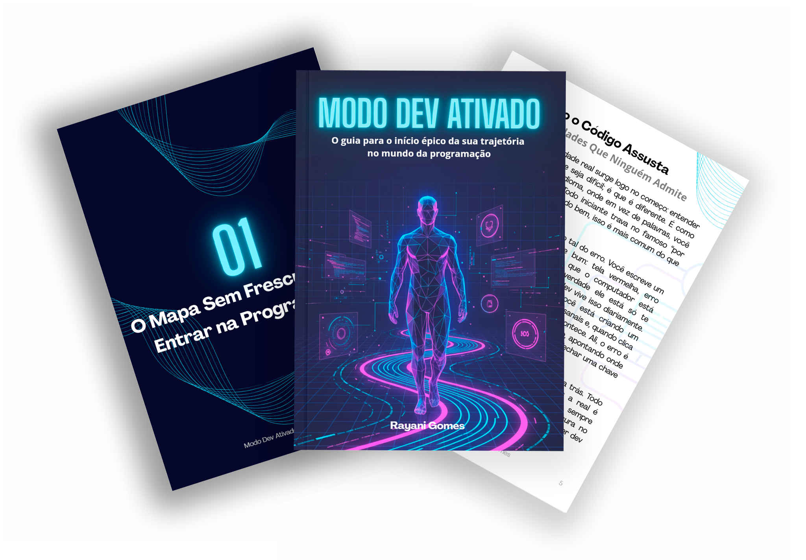

> Boot da Carreira é o guia para quem decidiu entrar na programação, mas ainda se sente perdido sobre por onde começar. Aqui, você aprende o básico com clareza, entende os conceitos sem enrolação e coloca a mão no código logo nos primeiros capítulos. Pensado especialmente para adultos em transição de carreira, este e-book te mostra o caminho real, simples e possível para dar seus primeiros passos na tecnologia com segurança e confiança.

# Projeto Podcast Gerado por I.A.s

 > ℹ️ **NOTE:** Este é o repositório desenvolvido durante o Bootcamp Universia - Fundamentos de IA Generativa

Projeto com o objetivo de gerar um e-book utilizando ferramentas de IA através de prompts mais trabalhado.

## 💻 Tecnologias utilizadas no projeto

- [ChatGPT](https://chat.openai.com/) 
- [Gemini](https://gemini.google.com/app)
- [Canva](https://www.canva.com/)

## ✨ Como foi feito ?

- Titulo e conteúdo gerado via chatgpt
- Gemini para gerar capa
- Canva para a diagramação

## 📚 Materiais

- [Notion Template](https://www.notion.so/EAS-E-book-AI-Studio-2ab015f3e0ba80cca5a8f2acf1fb4d4e?source=copy_link)
- [Canva Diagramação](https://www.canva.com/design/DAG4tWTrKTw/hsZBE8m_mTh-mghxmvQTzQ/edit?utm_content=DAG4tWTrKTw&utm_campaign=designshare&utm_medium=link2&utm_source=sharebutton)

## 👨‍💻 Autora

    
    
&nbsp&nbsp&nbspRayani Gomes 
    &nbsp&nbsp&nbsp
    <a 
        href="https://github.com/RayaniGomes">
        GitHub
    </a>
    &nbsp;|&nbsp;
    <a 
        href="https://www.linkedin.com/in/rayani-gomes-466925179/">
        LinkedIn
    </a>
    &nbsp;|&nbsp;

  

---

⌨️ com 💜 por [Rayani Gomes](https://github.com/RayaniGomes)
